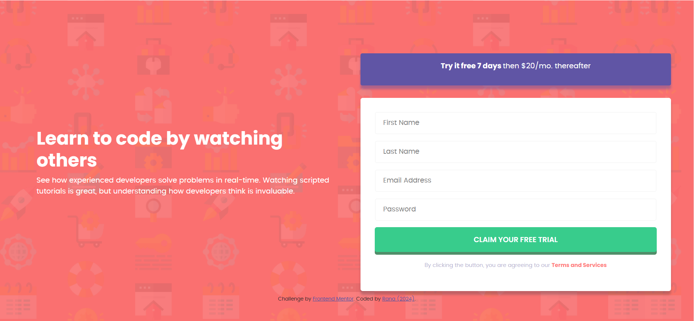
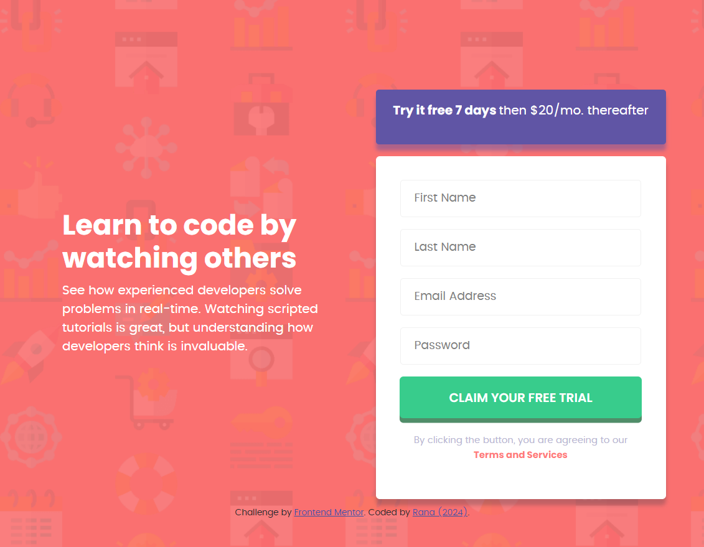

# Frontend Mentor - Intro component with sign up form solution

This is a solution to the [Intro component with sign up form challenge on Frontend Mentor](https://www.frontendmentor.io/challenges/intro-component-with-signup-form-5cf91bd49edda32581d28fd1). Frontend Mentor challenges help you improve your coding skills by building realistic projects.

## Table of contents

- [Overview](#overview)
  - [The challenge](#the-challenge)
  - [Screenshot](#screenshot)
  - [Links](#links)
- [My process](#my-process)
  - [Built with](#built-with)
  - [What I learned](#what-i-learned)
  - [Continued development](#continued-development)
- [Author](#author)
- [Acknowledgments](#acknowledgments)

**Note: Delete this note and update the table of contents based on what sections you keep.**

## Overview

### The challenge

Users should be able to:

- View the optimal layout for the site depending on their device's screen size
- Receive an error message when the `form` is submitted if:
  - Any `input` field is empty. The message for this error should say _"[Field Name] cannot be empty"_
  - The email address is not formatted correctly (i.e. a correct email address should have this structure: `name@host.tld`). The message for this error should say _"Looks like this is not an email"_

### Screenshot

#### website full width



#### website tablet width



#### website phone width


### Links

- Solution URL: [Add solution URL here](https://your-solution-url.com)
- Live Site URL: [Add live site URL here](https://your-live-site-url.com)

## My process

### Built with

- Semantic HTML5 markup
- CSS custom properties
- Flexbox
- javascript

### What I learned

There are many things I learnt doing this challenge mainly:

- how to add a background image in the body

  - ```css
    /* to create the rows */
    body {
      background-image: url("images\\bg-intro-desktop.png");
    }
    ```

- application of flexbox

  - I used flexbox a ton on this project in order to achieve the desired output

    ```css
    /* to create the rows */
    .components {
      text-align: center;
      justify-content: center;
      display: flex;
      align-items: center;
      flex-direction: row;
    }
    ```

- The use of DOM
- The use of javascript to make the website active.

### Continued development

In the future:

- code more complex script to manage the inputs

## Author

- Portfolio - [Rana](https://portofolio-8jzk.onrender.com/)
- Frontend Mentor - [@yourusername](https://www.frontendmentor.io/profile/RanaHafez)
- Linkedin - [Rana Hafez](https://www.linkedin.com/in/rana-hafez-a34315227/)

# Rana (2024)
